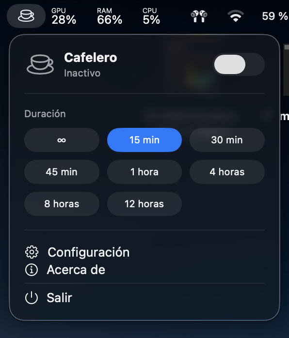

# ☕️ Cafelero

> Mantén tu Mac despierto con un solo clic.

Cafelero es una aplicación ligera para la barra de menú de macOS que evita que el equipo entre en reposo o active el salvapantallas mientras trabajas, presentas o descargas archivos.

[](https://github.com/pablo96sancho/Cafelero/releases/latest)

---

## 🚀 Características

- ☕️ Activación rápida desde la barra de menú
- ⏱️ Temporizador configurable para mantener el sistema despierto
- 💻 Diseño nativo, ligero y centrado en macOS
- ⚙️ Modo continuo para evitar interrupciones durante el trabajo

---

## 📸 Vista previa



---

## 📦 Instalación

1. Descarga la última versión desde [GitHub Releases](https://github.com/pablo96sancho/Cafelero/releases/latest).
2. Abre el archivo `Cafelero-Installer.dmg`.
3. Arrastra **Cafelero.app** a la carpeta **Aplicaciones**.
4. Ejecuta la app desde la barra de menú.

---

## 🔒 Permisos

Si activas la opción de respaldo de teclado neutro, macOS pedirá permiso de **Accesibilidad** la primera vez que se envíe el evento `CGEvent`.

Puedes concederlo en:

**Ajustes del Sistema → Privacidad y seguridad → Accesibilidad**

Si solo usas la assertion de IOKit, no se necesita ningún permiso especial.

---

## 🛠️ Desarrollo

### Requisitos

- macOS 13 o superior
- Xcode 15+ o Xcode Command Line Tools (`xcode-select --install`)
- Swift 5.9+

### Compilar y ejecutar

```bash
cd Cafelero
chmod +x build_and_run.sh
./build_and_run.sh
```

Esto compila y ejecuta la app desde SwiftPM, generando el paquete `.app` listo para usar.
